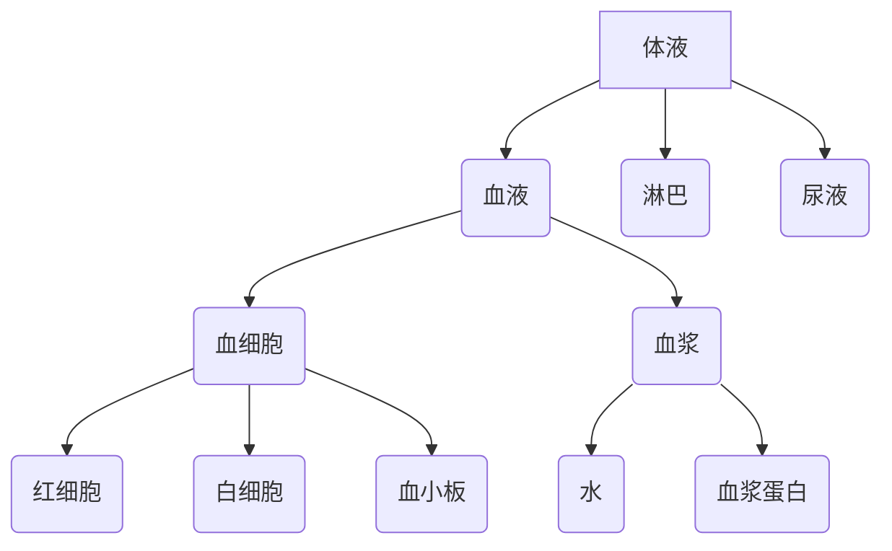
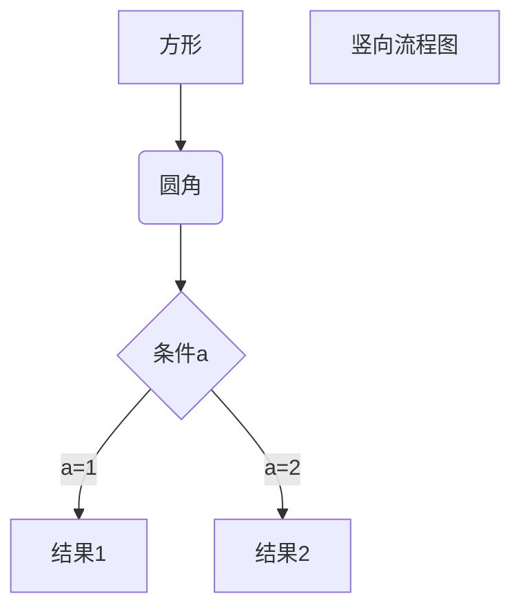

# 血液

## 一、血液的组成

​	血液的组成：血细胞和血浆（血细胞占45%，血浆占55%）

​	血细胞的组成：红细胞、白细胞、血小板

​	血浆的组成：水和血浆蛋白

​	血浆蛋白包括清蛋白、球蛋白、纤维蛋白原等。

​	血清：离体后的血液经自然凝固，分离出来的淡黄色透明液体；

​	血浆：血液加抗凝剂后分离出来的淡黄色液体

​	正常成人约4-5L,约占体重的6%-8%。

​	正常人血液pH7.35-7.45

​	正常人约为290-310mOsm/(kg·H2O)

## 二、正常数值

