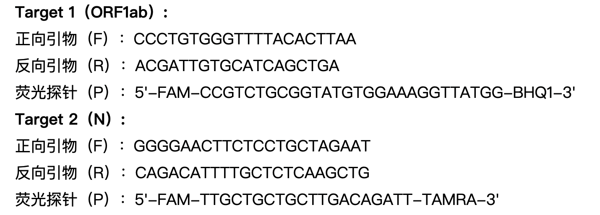
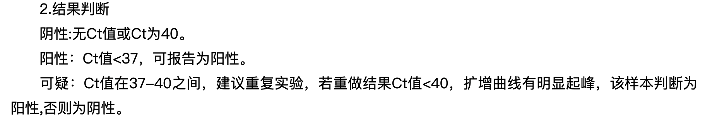

# 2019-nCoV（新冠病毒）检测方法（上）

2019年12月底，有一种未知病毒在中国武汉突然爆发，恰逢春节，又是全国返乡高峰，为未知病毒在国内大肆传播提供了基础；2020年中国最黑暗的时刻拉开了序幕……

这种病毒就是新冠病毒；它让全国上下团结一心，共同抗疫，也让我们见识了中国科研的实力，让生物行业进入人们的视野。经过一年多的恢复，现在人们的生活也基本重新步入正轨，但那段时间却如烙印一般无法抹去。

这段时间中产生了很多科研成果，使得中国生物行业得到了蓬勃发展，这其中有很多知识是需要我们来学习的，我们先从疫情之初也是最重要的新冠检测方法来进行回顾。

中国疾控中心（CDC）在2020年1月3日完成全基因组测序后，中国疾控中心病毒病预防控制所于2021年1月21日公开了[新冠病毒核酸检测引物、探针以及RT-PCR判读标准](http://www.chinaivdc.cn/kyjz/202001/t20200121_211337.htm)。（RT-PCR原理之前推文有讲过，没看过的同学请点链接阅读）

1、引物和探针序列





通过公布的引物和探针可以看出，中国疾控中心建议使用两对引物进行检测；但是为什么需要两对引物来检测，为什么需要选取这两种基因作为参考呢？这就是一个很重要的知识点了。

首先来说ORF1ab基因，这可不是“ORFLab基因”，这其实是两个基因位点，分别是ORF1a和ORF1b位点，这是众多冠状病毒共有的位点，占总基因组的2/3左右，为开放阅读框基因，在rep基因中，是病毒开始合成各种蛋白质的重要基因，为病毒在细胞中的逆转录提供基础；但最重要的就是这对基因具有很强的保守性，几乎不会产生突变[1]，故被选作识别基因之一。

之后是N基因，这是和壳体蛋白基因，后段能够合成核壳体蛋白，这种蛋白有很强的特异性，不同的病毒会有不同的序列[2~4]，所以也是由于这种特异性被选作识别基因。

说了这么多，但到底为什么需要两种基因同时作为识别基因呢？原因就是通过ORF1ab基因可以确定是否有冠状病毒，N基因用来确定病毒是否为新冠病毒；这种双重保障也就降低了新冠病毒出现假阳性和假阴性的概率。

虽然这种双重保障能使qPCR假阳性和假阴性的概率降低到很多，但还是在RNA提取到检测过程中会有一些随机误差无法避免；后来引入复检也是为了降低假阴性和假阳性，但是还是会出现一部分假阴性和假阳性；还会有更好的方法解决准确性的问题吗？

下期预告，比qPCR法更准确的方法——IgG/IgM法的原理，以及qPCR与IgG/IgM的优劣对比。


```shell
[1]柳树群,过涛,季星来,孙之荣.SARS-CoV蛋白质组的生物信息学及其进化关系[J].科学通报,2003(13):1359-1368.
[2]秦鄂德,祝庆余,于曼,范宝昌,常国辉,司炳银,杨保安,彭文明,姜涛,刘伯华,邓永强,刘洪,张雨,王翠娥,李豫川,甘永华,李晓萸,吕富双,谭刚,曹务春,杨瑞馥,汪建,李蔚,徐祖元,李彦,吴清发,林伟,陈维军,唐琳,邓亚军,韩玉军,李昌峰,雷蒙,李国庆,李文杰,吕宏,石建萍,童宗中,张峰,李松岗,刘斌,刘斯奇,董伟,王俊,黄家树,于军,杨焕明.SARS相关病毒(BJ01株)的全序列及其比较分析[J].科学通报,2003(11):1127-1134.
[3] Rota P A ,  M Steven O ,  Monroe S S , et al. Characterization of a novel coronavirus associated with severe acute respiratory syndrome[J]. Science (New York, N.Y.), 2020, 2003年300卷5624期(5624):1394-9页.
[4]Marra,  Marco A , Jones, et al. The Genome Sequence of the SARS-Associated Coronavirus.[J]. Science, 2003.
```


