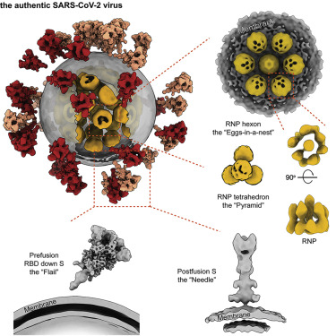
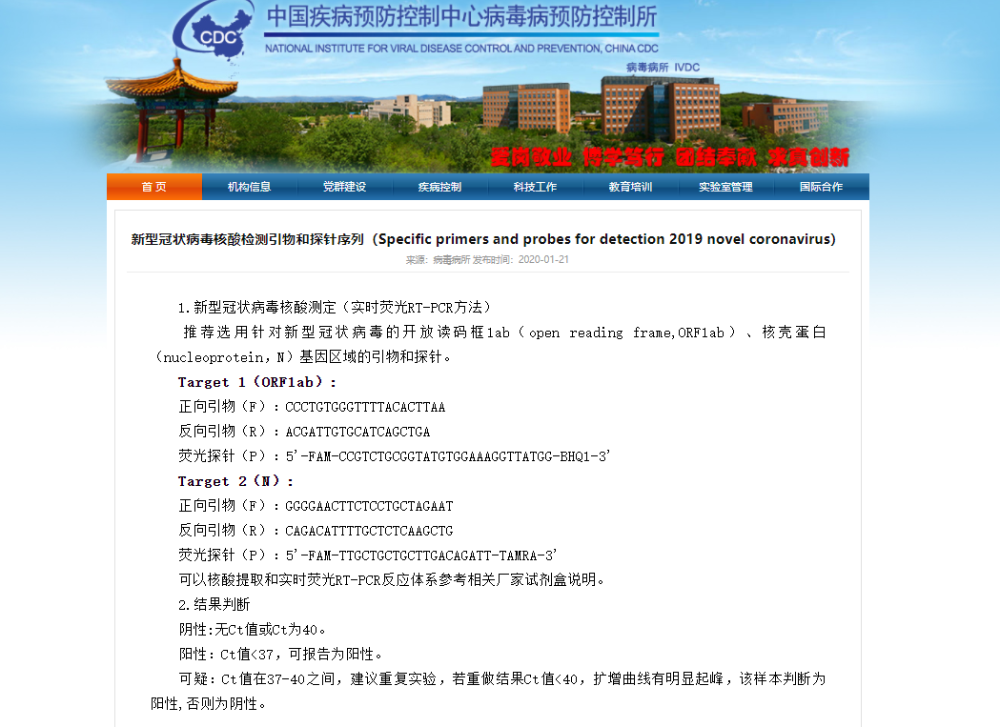

# 2019-nCoV（新冠病毒）检测方法（上）
<font face="黑体">

> &nbsp; 2019年12月底，一种未知病毒在中国武汉突然爆发，而当时春节将至，正是全国返乡高峰期，为这种病毒在国内大肆传播提供了条件；与此同时，中国“迎”来了最艰难的2020年。这种病毒就是新冠病毒。

<font face="黑体">
&nbsp; 从病毒发现到全基因组序列的公布，用时9天；从全基因组序列的公布到检测方法的发现，用时14天。短短23天，让我们见证了中国科研实力的雄厚，也使得生物行业蓬勃发展。下面，我们先从疫情之初也是最重要的新冠检测方法来进行回顾。



<font face="黑体">
 <font size=1 ><div align="center">新冠病毒结构<sup>[1]</sup></div></font>

<font face="黑体">
&nbsp; 在2020年1月7日完成全基因组测序后，中国疾控中心病毒病预防控制所于2021年1月21日公开了[新冠病毒核酸检测引物、探针以及RT-PCR判读标准](http://www.chinaivdc.cn/kyjz/202001/t20200121_211337.htm)。（RT-PCR原理之前推文有讲过，没看过的同学请点链接阅读）

 

<font face="黑体">
 <font size=1 ><div align="center">中国疾控中心病毒病研究所官网公布的新冠病毒RT-PCR检测方法</div></font>
<font face="黑体">
&nbsp; 通过公布的引物和探针可以看出，中国疾控中心建议使用两对引物进行检测；但是为什么需要两对引物来检测，为什么需要选取这两种基因作为参考呢？这就是一个很重要的知识点了（记得拿小本本记下来呦）。
<font face="黑体">
&nbsp; 首先来说ORF1ab基因，这可不是“ORFLab基因”，这其实是两个基因，分别是ORF1a和ORF1b，为开放阅读框基因，ORF1ab基因在复制酶基因rep中，是病毒开始合成各种蛋白质的重要基因，也是众多冠状病毒共有的基因，最重要的是这对基因具有很强的保守性，几乎不会产生突变<sup>[2]</sup>，故被选作识别基因之一。
<font face="黑体">
&nbsp; 之后是N基因，这是核壳体蛋白基因，后段能够合成核壳体蛋白。不同的病毒会有不同的蛋白序列<sup>[3~5]</sup>，所以这种基因有很强的特异性，故被选作识别基因之一。
<font face="黑体">
&nbsp; 说了这么多，但到底为什么需要两种基因同时作为识别基因呢？原因就是通过ORF1ab基因可以确定是否有冠状病毒，N基因用来确定病毒是否为新冠病毒；这种双重保障也就降低了新冠病毒出现假阳性和假阴性的概率。
<font face="黑体">
&nbsp; 虽然这种双重保障能使qPCR检测出现假阳性和假阴性的概率降低很多，但是从RNA提取到检测过程中还会有一些随机误差产生；后来引入复检也是为了降低出现假阳性和假阴性的概率，但是还无法完全避免其出现；难道就没有更好的方法解决准确性的问题吗？
<font face="黑体">
&nbsp; 下期预告，比qPCR法更准确的方法——IgG/IgM法的原理，以及qPCR与IgG/IgM的优劣对比。


```
[1] Hangping Yao, Yutong Song, Yong Chen, et al.Molecular Architecture of the SARS-CoV-2 Virus,Cell,Volume 183, Issue 3,2020,Pages 730-738.e13,
[2] 柳树群,过涛,季星来,孙之荣.SARS-CoV蛋白质组的生物信息学及其进化关系[J].科学通报,2003(13):1359-1368.
[3] 秦鄂德,祝庆余,于曼等.SARS相关病毒(BJ01株)的全序列及其比较分析[J].科学通报,2003(11):1127-1134.
[4] Rota P A ,  M Steven O ,  Monroe S S , et al. Characterization of a novel coronavirus associated with severe acute respiratory syndrome[J]. Science (New York, N.Y.), 2020, 2003年300卷5624期(5624):1394-9页.
[5] Marra,  Marco A , Jones, et al. The Genome Sequence of the SARS-Associated Coronavirus.[J]. Science, 2003.

```


