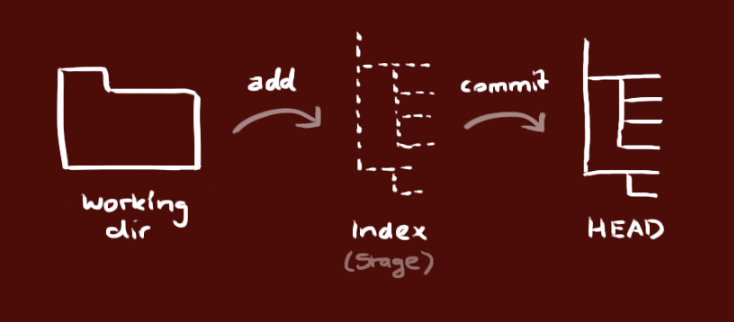

# Git的使用

*教程可参考[菜鸟教程git-简明指南](https://www.runoob.com/manual/git-guide/)*

## 1、下载

macOS：http://git-scm.com/download/mac

Windows：http://msysgit.github.io/

Linux：http://git-scm.com/download/linux

# 2、使用

### （1）创建本地仓库

#### <1>创建本地仓库

先创建一个文件夹，作为本地代码仓库，之后使用命令`git init`创建仓库

#### <2>从本地仓库克隆

```shell
git clone /path/to/repository
```

#### <3>从远端服务器克隆

```shell
git clone username@host:/path/to/repository
```

### （2）使用前的设置

添加远端服务器仓库

```shell
git remote add origin <server>
```

添加用户名和邮箱信息

```shell
git config –global --username "username"
git config –global --useremail "xxx@xxx.com"
```


### （3）添加和提交

你的本地仓库由 git 维护的三棵“树”组成。第一个是你的 `工作目录`，它持有实际文件；第二个是 `暂存区（Index）`，它像个缓存区域，临时保存你的改动；最后是 `HEAD`，它指向你最后一次提交的结果。



你可以提出更改（把它们添加到暂存区），使用如下命令：

```shell 
git add <filename>
git add *
```

这是 git 基本工作流程的第一步；使用如下命令以实际提交改动：

```shell
git commit -m "代码提交信息"
```

现在，你的改动已经提交到了 **HEAD**，但是还没到你的远端仓库。

执行如下命令以将这些改动提交到远端仓库：

```shell
git push origin master
```

可以把 *master* 换成你想要推送的任何分支。