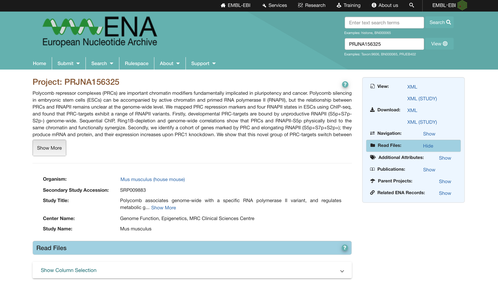
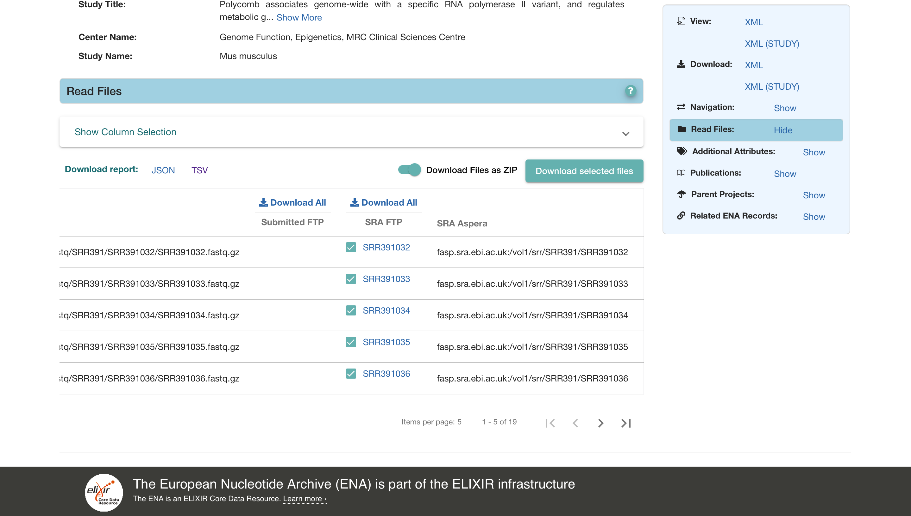
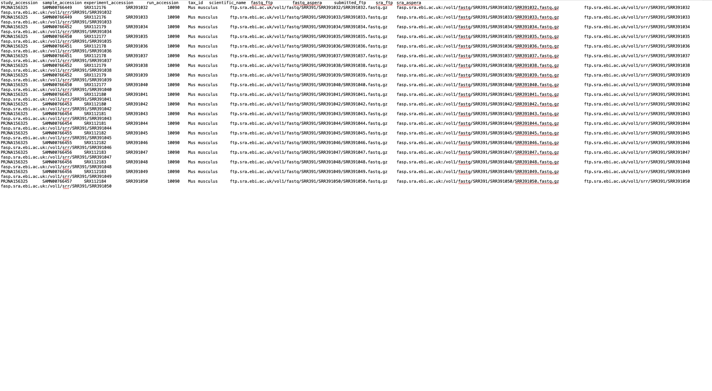

# IBM Aspera Connect的安装和使用

​	Aspera Connect是IBM公司开发的一款下载加速器，虽然目前NCBI不推荐使用，但可以在NCBI上查找需要的SRR或SRA号后，从EBI上直接获得Aspera下载链接，直接下载。

​	相对于sratools内置的prefetch工具来说，在国内存在墙的情况下，aspera下载速度能达到几M/s，prefetch只能有几十kb/s，这就大大节约了数据下载的宝贵时间，可以将更多的精力用于后续分析的学习中。		

## 1、IBM Aspera Connect下载

​	从[IBM Aspera Connect官网](https://www.ibm.com/aspera/connect/)上直接下载

## 2、使用方法

目前安装在Ubuntu和macOS上，不过使用方法都差不多。

### （1）下载单个sra文件或fastq文件

以SRR391032的sra文件为例

下载链接需要从EBI上获取

```shell
~/Applications/Aspera\ Connect.app/Contents/Resources/ascp -i ~/Documents/ssh_key/asperaweb_id_dsa.openssh -l 300M -T -P33001 -K1 era-fasp@ftp.sra.ebi.ac.uk/vol1/srr/SRR391/SRR391032 .
```

```shell
我没有将Aspera加入环境变量，所以需要从安装目录来启动软件，故前面的路径比较长
最后的是下载文件保存位置，"."表示当前目录，也可使用其他路径

参数介绍：
-i 密钥存放位置，一般在软件安装目录下就能找到，我单独复制出来保存到了我自己的文件夹中
-l 最大下载限速limit，一般设置为300M-500M，默认可以不设置，但是奇怪的是下载速度就很慢
-T 关闭加密传输
-P33001 用于SSH认证的TCP商品，一般设置为33001
-K1 打开断点续传
era-fast 默认用户名
@ 后面跟服务器域名
```


### （2）下载多个sra文件或fastq文件

首先需要在EBI上找到需要下载的SRA或Fastq文件的下载链接






在Show Column Selection中选中显示SRA Aspera链接，点击TSV可下载链接列表



只需要将最后一列链接的冒号后面的保存为file.list即可

```shell
~/Applications/Aspera\ Connect.app/Contents/Resources/ascp -i ~/Documents/ssh_key/asperaweb_id_dsa.openssh -l 300M -T -P33001 -K1 --mode recv --host fasp.sra.ebi.ac.uk --user era-fasp --file-list file.list ~/Documents/bioinformatics/chipseq/sra/ 
```

```shell
参数介绍：
--mode 一种下载模式，具体可以参照文档
--host 下载服务器的域名
--user EBI的通用用户名
--file-list 下载链接后缀表
```

